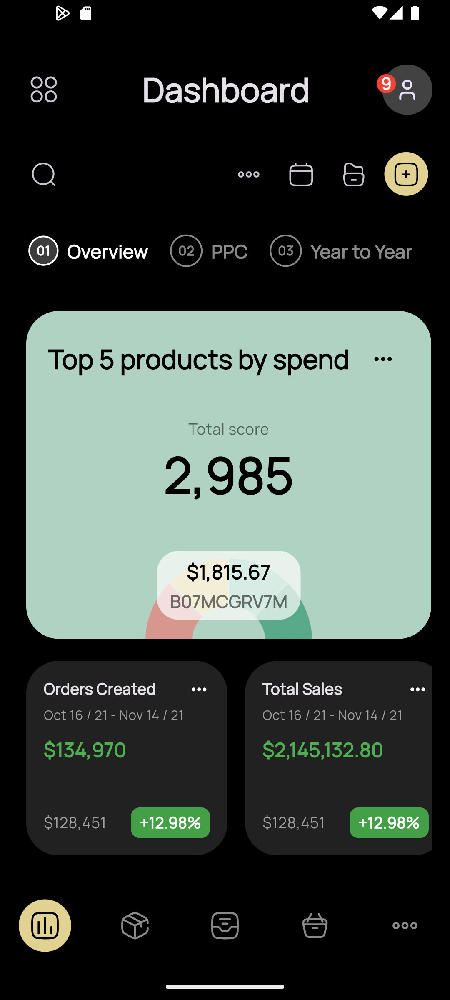
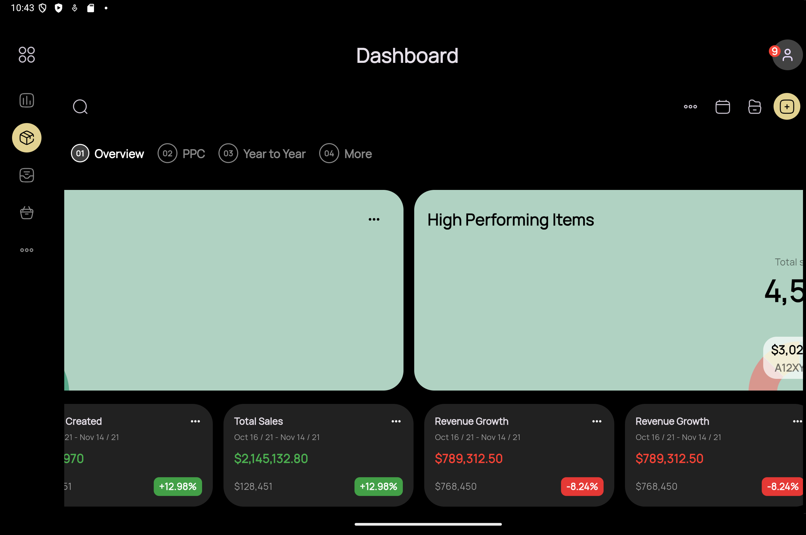

# UI Task - Responsive Flutter App

## Running the App with Multiple Devices Preview  

I used the **`device_preview`** package to simulate different screen sizes and devices.  

### **Enable Device Preview**  
To enable **device preview**, make sure to set it to `true` in your `main.dart`:

```dart

void main() {
  runApp(
    DevicePreview(
      enabled: true, //Set to true to preview multiple devices
      builder: (context) => const MyApp(),
    ),
  );
}
```

## Screenshots

### Mobile View
<p align="center">

</p>

### Tablet View 
<p align="center">
 
</p>

## How to Run  

### Clone the Repository  
```sh
git clone -b responsive https://github.com/thish-stack/ui_task.git
cd ui_task
```

### Install Dependencies  
```sh
flutter pub get
flutter pub add device_preview
```

### Run the App  
```sh
flutter run
```

### Open Device Preview to test responsiveness across different screen sizes.  

## Screen Orientation Settings  
- **Mobile Devices** →  Supports both **portrait & landscape** modes. 
- **Tablets & Larger Screens** → Supports both **portrait & landscape** modes.  


