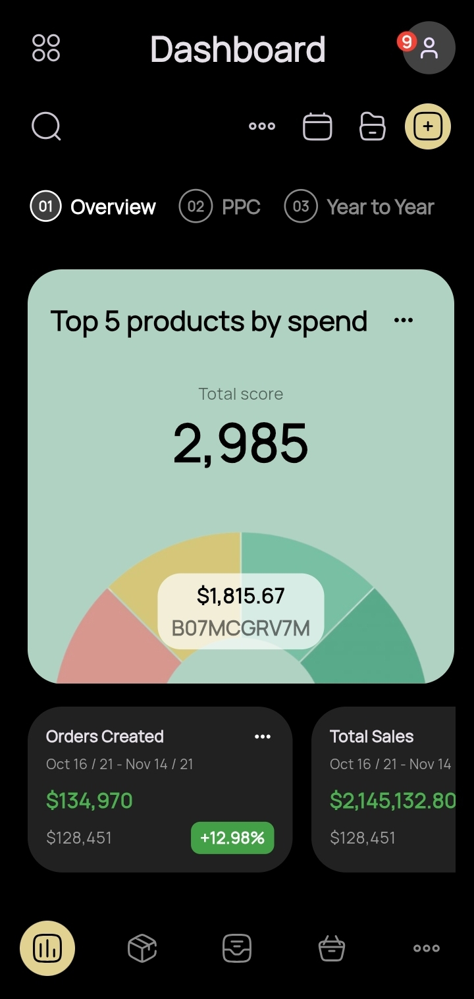
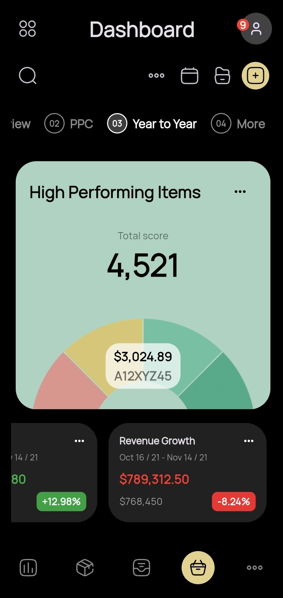

# UI Task

A new Flutter project.

## Inspiration

The UI was inspired by this design from Dribbble:  
[[Analytics Dashboard - Mobile View]](https://dribbble.com/shots/19602795-Analytics-Dashboard-Mobile-View)

## Home Screen

  
  

## Getting Started

This project is a starting point for a Flutter application.

A few resources to get you started if this is your first Flutter project:

- [Lab: Write your first Flutter app](https://docs.flutter.dev/get-started/codelab)
- [Cookbook: Useful Flutter samples](https://docs.flutter.dev/cookbook)

For help getting started with Flutter development, view the  
[online documentation](https://docs.flutter.dev/), which offers tutorials,  
samples, guidance on mobile development, and a full API reference.
